# RFD3 替换式 NMF 实验汇报 PPT 写法

> 用途：组会汇报 / 答辩预演 / 论文式技术汇报。
>
> 说明：下面尽量把原来的“图建议”都改成了可以直接放进 Markdown 的 Mermaid 图；如果你用的是支持 Mermaid 的编辑器，可以直接渲染。
>
> 这份文档里每一页都同时提供两部分内容：
>
> - `这一页怎么讲`：告诉你这一页的逻辑、重点和讲述顺序。
> - `可直接照读的讲稿`：一段可以直接在台上念出来的完整文字。
>
> 我尽量用严谨、直接、非比喻式的语言来写，目标是让不熟悉背景的人也能听懂。
>
> 建议页数：12–18 页。这里我按 18 页给出一套完整、可直接落 PPT 的结构。

---

## Slide 1. 标题页

### 标题

RFD3 替换式 NMF 实验：层选择、数学原理、源码嵌入与单结构结果分析

### 副标题

- 基于 `single_structure` 的单结构微调 / 过拟合实验
- Baseline vs `ffn_core` vs `proj_mix` vs `head_plus_proj`

### 这一页怎么讲

这一页的作用是把汇报主题和问题范围讲清楚。第一，要说明这次汇报关注的是替换式 NMF 在 RFD3 上的应用，而不是泛泛地介绍 NMF。第二，要说明这次工作分成三个层次：层选择、数学原理、源码实现和实验分析。第三，要让听众知道后面的结论会围绕“哪些层适合 NMF、NMF 是否带来整体收益、这些结果如何从源码和实验配置中解释”展开。

### 可直接照读的讲稿

大家好，这次汇报的主题是 RFD3 上的替换式 NMF 实验。这里我主要想回答三个问题。第一个问题是，在 RFD3 里哪些层适合做替换式 NMF，哪些层不适合。第二个问题是，NMF 的数学形式是什么，为什么这里采用的是可训练的非负低秩参数化，而不是一次性的离线分解。第三个问题是，如何在现有源码里把这种替换稳定地嵌入训练流程，并且如何根据实验结果判断这种替换到底改善了模型还是损害了模型。整场汇报会按照“动机、方法、实现、实验、结果、结论”这条主线展开。

### 图建议

- 这一页通常不放图，或者只放一个很轻的“模型 → NMF → 实验 → 结果”流程引导图。

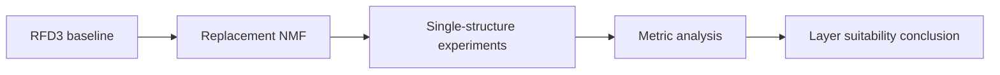


---


## Slide 2. 为什么要做 NMF


### 核心内容

- 全参数微调成本高、风险大
- 想要一种“参数高效、层级可控、可解释”的替换方式
- NMF 可以把线性层改写成低秩非负结构，从而做机制级别的层分析


### 这一页怎么讲

这一页先解释为什么这个方向值得做。全参数微调会更新模型的全部参数，这样的代价是训练成本和显存成本都比较高，而且当数据规模较小时，模型容易偏向当前数据分布，原有能力也可能被破坏。相比之下，替换式 NMF 只修改部分线性层，并且用低秩非负形式来重新表达这些层的参数，因此更适合作为结构分析工具。这里的重点不是单纯压缩参数，而是判断不同功能的层在被替换之后，模型行为会发生什么变化。我们希望通过这种受控替换，区分哪些层对结构预测结果比较敏感，哪些层相对稳定，哪些层不适合直接做非负低秩化。

### 可直接照读的讲稿

做这个实验的原因主要有三个。第一，全参数微调的成本比较高，训练过程对显存和算力的要求都更大。第二，如果训练数据比较少，模型在全参数更新后容易偏向当前数据分布，这样会带来比较强的行为变化，不利于做机制分析。第三，我们希望得到一种参数高效、层级可控、同时又具有一定可解释性的替换方式。NMF 的作用就在这里：它把线性层重写成低秩非负结构，让我们能够逐层判断，哪些模块更适合被这种结构替换，哪些模块替换后会明显影响模型性能。换句话说，这里不是单纯追求压缩参数，而是把 NMF 当作一种结构探针，用来分析 RFD3 内部不同层的功能差异。

### Mermaid 图

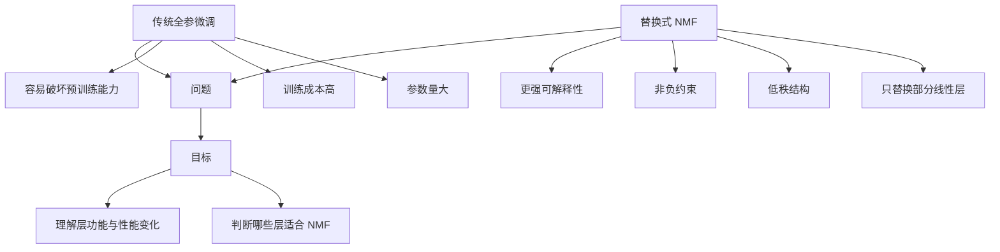


---


## Slide 3. RFD3 的整体结构概览


### 核心内容

- RFD3 是扩散式蛋白结构生成模型
- 模型主干中存在多类可替换线性层：
  - embedding / token initializer
  - diffusion module
  - transition / process / projection / head 层


### 这一页怎么讲

这一页要让听众先建立对模型结构的整体认识。RFD3 不是一个单一的线性网络，而是由多个功能不同的模块组成。不同模块中的线性层承担的任务也不同，有些层主要负责特征变换，有些层负责不同表示之间的组合，有些层则直接参与输出预测。后面的 NMF 实验并不是在所有层上平均替换，而是根据层所在的位置和功能，挑选一部分最有可能被非负低秩化的层进行实验。这样做的原因是，不同层的可替换性差别很大。如果不区分层的功能就直接替换，实验结果很难解释，也很难判断问题到底出在 NMF 形式本身，还是出在替换目标选错了。

### 可直接照读的讲稿

这里先介绍一下 RFD3 的整体结构。RFD3 是一个扩散式蛋白结构生成模型，它的内部包含多个功能不同的模块。模型里有负责输入表示构造的部分，也有负责扩散过程建模的部分，还有负责特征变换、特征组合以及最终输出的部分。对于 NMF 来说，这些模块并不是同等适合的。因为不同层承担的功能不同，所以它们被替换之后对模型行为的影响也不同。我的实验不是对所有线性层做统一替换，而是根据层的功能和位置进行筛选，先挑出更有可能适合低秩非负重参数化的层，再逐步扩大替换范围。这样做的目的，是让实验结果更容易解释，也更容易定位性能变化来自哪里。

### Mermaid 图

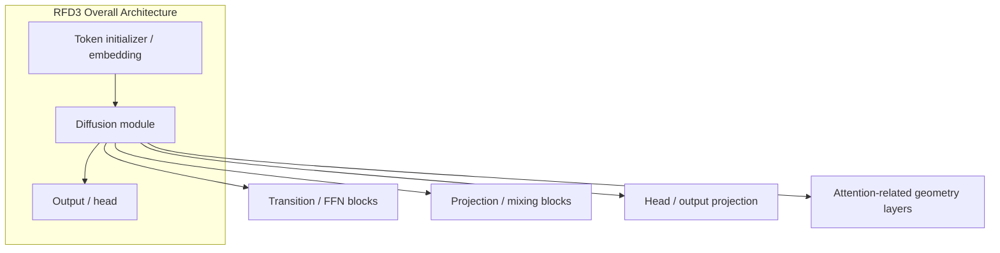


---


## Slide 4. RFD3 各层的功能分类与 NMF 适配性


### 核心内容

把层分为四类：

1. FFN / transition / process 类
2. projection / mixing 类
3. output head 类
4. attention 几何类（`to_q` / `to_k` / `to_v`）


### 这一页怎么讲

这一页的重点是解释“为什么选这些层”。第一类层，也就是 FFN、transition、process 这一类，主要作用是做特征维度上的变换和重编码，它们的参数通常是普通线性层，因此比较适合尝试低秩非负替换。第二类层，也就是 projection 和 mixing 类，负责把不同来源的信息重新组合起来，这类层也能做 NMF，但它们通常比第一类层更敏感，因为它们离最终输出更近。第三类层是输出头，它直接影响模型最后输出的形式，因此即使可以替换，也应当放在更靠后的 ablation 里。第四类是 attention 的几何层，也就是 `to_q`、`to_k`、`to_v` 这些位置，它们直接参与注意力权重的构造，通常依赖带符号的权重分布，因此不适合作为第一轮 NMF 的优先目标。这个分类是后续所有实验设计的基础。

### 可直接照读的讲稿

这里我把 RFD3 里的线性层分成四类来讨论。第一类是 FFN、transition 和 process 类层，它们的作用主要是做特征转换和特征重编码，这些层通常最适合先尝试 NMF。第二类是 projection 和 mixing 类层，这些层负责把来自不同位置或不同模块的信息重新组合起来，它们也可以尝试 NMF，但一般比第一类更敏感。第三类是输出头，它直接决定最终输出的形式，因此如果要替换，风险通常更高。第四类是 attention 的几何层，也就是 `to_q`、`to_k`、`to_v` 这类层，它们直接参与注意力分布的构造，对权重符号和数值范围都比较敏感，所以不适合作为第一轮替换对象。后面的实验就是按照这个分类逻辑，逐步扩大替换范围，观察性能变化。

### Mermaid 图

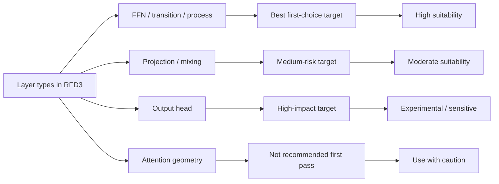


---


## Slide 5. NMF 的数学原理


### 核心内容

经典 NMF：

$$
W \approx UV, \quad U \ge 0,\; V \ge 0
$$

目标通常是最小化重构误差：

$$
\min_{U,V \ge 0} \left\|W - UV\right\|_F^2
$$


### 这一页怎么讲

这一页需要把数学形式说清楚，但不需要假设听众已经熟悉 NMF。可以直接说明：如果原来有一个线性层，它的权重矩阵记作 W，那么 NMF 的目标就是把这个矩阵表示成两个较小矩阵的乘积 UV，而且这两个矩阵都要求元素非负。这样做的意义是把原来的一个大矩阵变成两个低秩矩阵，从而降低自由度。这里的实验不是把模型先训练好之后再离线分解，而是把这种分解直接写进模型结构中，让 U 和 V 作为可训练参数参与训练。这样做之后，模型在训练过程中就会持续调整这两个低秩矩阵，使它们适应当前任务，而不是只依赖一次性预处理结果。

### 可直接照读的讲稿

这一页介绍 NMF 的基本数学形式。对于一个线性层来说，它的核心参数是一个权重矩阵 W。NMF 的目标不是直接使用这个矩阵，而是将它近似表示成两个较小的矩阵 U 和 V 的乘积，也就是 W 近似等于 UV，并且要求 U 和 V 都是非负的。训练的时候通常会最小化原矩阵和重构矩阵之间的差异，也就是最小化 Frobenius 范数意义下的重构误差。我们在这里采用的不是离线分解，而是把这个分解写进模型结构中，让 U 和 V 成为可训练参数。这样一来，模型在训练过程中会持续调整这两个矩阵，而不是只靠一次性的预处理结果。这样做的目的，是让 NMF 成为一个能直接参与深度学习训练流程的模块。

### Mermaid 图

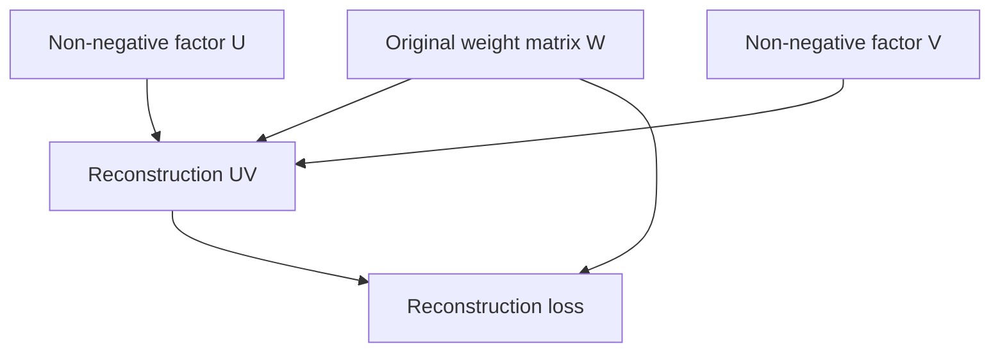


---


## Slide 6. 为什么用 softplus 参数化


### 核心内容

- 参数通过 `softplus` 映射到非负域
- 优点：
  - 梯度平滑
  - 训练稳定
  - 避免 hard clamp 带来的不连续
- 缺点：
  - 不是传统 ALS / multiplicative-update 风格的经典 NMF


### 这一页怎么讲

这一页需要解释为什么实现里不是直接把参数截断到非负，而是使用 `softplus`。原因很直接：如果使用硬截断，参数一旦进入负值区域，梯度可能会变得不稳定，优化过程也容易出现不连续的变化。`softplus` 的作用是把原始参数平滑地映射到非负数，这样训练仍然可以使用标准的反向传播，整个过程更容易稳定运行。这里需要明确一点，这种实现并不是经典线性代数教材里常见的交替最小化算法，也不是乘法更新法；它是一种适合深度学习训练流程的非负低秩重参数化方法。我们选择它的原因不是理论上最纯粹，而是工程上更稳定、也更适合嵌入现有训练框架。

### 可直接照读的讲稿

这一页解释的是为什么要用 `softplus`。在我们的实现里，NMF 的两个因子不是直接约束为非负，而是先保留原始参数，再通过 `softplus` 把它们映射到非负区域。这样做的原因是，`softplus` 是连续可导的，因此训练时可以直接使用标准反向传播，不需要额外处理不可导的硬截断。相比之下，如果直接用 clipping 或 hard projection，优化过程可能出现不连续，训练稳定性也会变差。需要说明的是，这个实现不是经典的交替最小化 NMF，也不是传统乘法更新算法，而是一种更适合深度学习训练流程的非负低秩重参数化方法。我们采用它的原因主要是工程稳定性和可训练性，而不是为了复现某一种纯数学求解器。

### Mermaid 图

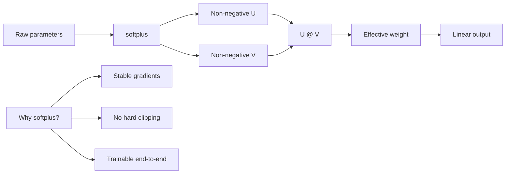


---


## Slide 7. 如何在源码里嵌入 NMF


### 核心内容

代码路径：

- `models/rfd3/src/rfd3/nmf.py`
- `models/rfd3/src/rfd3/train_lora.py`
- `models/rfd3/configs/experiment/nmf_*.yaml`


### 这一页怎么讲

这一页要把工程实现讲清楚。首先，`nmf.py` 里定义了 replacement NMF 的具体层实现，也就是如何用两个非负低秩矩阵替代一个原始线性层。其次，`train_lora.py` 负责训练流程，它在模型构建以后、训练开始以前，把这些替换逻辑统一接入进去，因此无论是 LoRA 还是 NMF，都可以通过同一个训练入口来控制。第三，`yaml` 配置文件负责决定实验目标，比如哪些层可以被替换、rank 取多大、alpha 和 eps 取什么值。这样做的好处是，实验不再依赖手工修改代码，而是可以通过配置切换不同的层组，得到可复现的实验结果。最后，训练结束后会写出 `run_summary.json`，供 sweep 脚本汇总和比较。

### 可直接照读的讲稿

这一页介绍 NMF 是怎么嵌入现有代码的。核心实现放在 `models/rfd3/src/rfd3/nmf.py`，这里定义了替换式 NMF 的线性层，也定义了把原始层替换成 NMF 层的递归函数。训练入口放在 `train_lora.py`，虽然文件名里写的是 LoRA，但当前实现已经支持在同一个入口里统一处理 LoRA 和 NMF 的注入逻辑。实验配置则放在 `models/rfd3/configs/experiment` 目录下，通过不同的 YAML 文件指定不同的目标层组和超参数。这样做以后，实验就变成了一个标准化流程：先读配置，再构建模型，然后替换目标层，随后进行训练，最后把训练结果写入 `run_summary.json`，再由 sweep 脚本汇总成对比表。这样整个实验过程是可复现、可追踪、可比较的。

### Mermaid 图

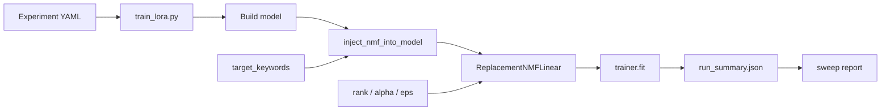


---


## Slide 8. 替换策略设计：从保守到激进


### 核心内容

四个 setting：

- `baseline`
- `ffn_core`
- `proj_mix`
- `head_plus_proj`


### 这一页怎么讲

这一页的重点是解释实验为什么要分成四档，而且为什么要按照这个顺序。`baseline` 是不启用 NMF 的参考模型，用来提供性能基线。`ffn_core` 只替换最保守、最核心的 transition 和 FFN 类层，用来检验最容易接受的替换是否可行。`proj_mix` 在此基础上进一步加入 projection 和 mixing 层，测试更广范围的线性层替换是否仍然可接受。`head_plus_proj` 在前面的基础上再加入输出头，属于最激进的一档。这样的设计让我们能逐级观察性能变化，而不是一次性引入太多改动。这样做的目的，是把“层的功能”和“性能变化”尽可能对应起来，避免实验结论过于笼统。

### 可直接照读的讲稿

这一页介绍实验是如何分组的。我们总共设置了四个实验条件。第一个是 `baseline`，也就是不使用 NMF 的原始模型，它作为参考基线。第二个是 `ffn_core`，它只替换最核心、最保守的 FFN 和 transition 类层，用来先验证最安全的替换方案是否可行。第三个是 `proj_mix`，在前面的基础上进一步加入 projection 和 mixing 层，测试更广范围的线性层替换效果。第四个是 `head_plus_proj`，它在前面的基础上继续加入输出头，是当前实验里最激进的一档。采用这种递进式设计的目的，是逐步扩大替换范围，观察性能变化是否与层功能有关，从而得到更有解释力的结论。

### Mermaid 图

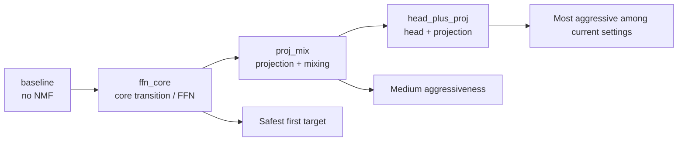


---


## Slide 9. 实验配置

### 核心内容

本次 sweep 不是所有 setting 共享同一组 `target_keywords`，而是每个 YAML 配置对应一组不同的替换目标。共同的配置项包括：

- 数据：`pdbmirror` 数据集
- 训练起点：`/media/zzj/Data/rfd3_latest.ckpt`
- NMF 形式：`replacement`
- `rank = 8`
- `alpha = 1.0`
- `eps = 1e-6`
- `nonnegative_param = softplus`
- `reset_optimizer = true`
- 训练日志：`logger=csv`
- 验证频率：每个 epoch 验证一次

各 setting 的 `target_keywords` 分别是：

| setting | YAML 文件 | `target_keywords` |
| --- | --- | --- |
| `ffn_core` | `nmf_ffn_core_single_structure.yaml` | `transition_post_token`, `transition_post_atom`, `transition_1`, `process_s_init`, `process_z_init`, `transition_2`, `process_c`, `process_s_trunk`, `process_single_l`, `process_single_m`, `process_z`, `pair_mlp` |
| `proj_mix` | `nmf_proj_mix_single_structure.yaml` | `process_pll`, `project_pll`, `to_r_update`, `upcast.project`, `downcast.project`, `process_n`, `sequence_head` |
| `head_plus_proj` | `nmf_head_plus_proj_single_structure.yaml` | `process_pll`, `project_pll`, `to_r_update`, `sequence_head` |

### 这一页怎么讲

这一页要把实验配置讲完整，而且要特别强调一个事实：这次实验不是所有 setting 共用一份 `target_keywords`，而是每个 YAML 文件都对应不同的替换范围。因此，配置的核心不是“某一个固定目标集合”，而是“围绕不同层组分别设计不同的替换策略”。

首先，所有 setting 共享同一批训练基础配置：同样的数据集、同样的起点 checkpoint、同样的 NMF 低秩维度、同样的 `softplus` 非负参数化、同样的优化器重置方式，以及同样的日志和验证节奏。这保证了不同 setting 之间的比较是公平的。其次，不同 setting 的真正差别来自 `target_keywords`。`ffn_core` 只替换核心的 transition 和 FFN 类层，因此它代表的是最保守的替换范围。`proj_mix` 扩展到了 projection 和 mixing 相关层，因此它比 `ffn_core` 更激进。`head_plus_proj` 进一步纳入输出头相关层，因此它是当前实验中最激进的一组。

这一页还要说明，`target_keywords` 并不是随意命名，而是直接决定了 `inject_nmf_into_model` 递归替换哪些子模块。也就是说，YAML 文件中的关键词选择，实际上就是在定义“哪些功能层被认为适合做 NMF”。因此，这一页的重点不是列出统一的目标层，而是说明每个 setting 对应不同的层组设计，以及这种设计如何支撑后面关于“哪些层适合 NMF”的结论。

### 可直接照读的讲稿

这一页介绍实验配置。这里需要先说明一个很重要的事实：本次 sweep 里，不同的 YAML 配置文件对应的是不同的 `target_keywords`，所以不能把所有 setting 的替换目标写成一组统一的关键词。真正共享的是基础训练配置，包括同样的 `pdbmirror` 数据集、同样的预训练 checkpoint、同样的低秩 rank、同样的 `alpha`、`eps`、`softplus` 非负参数化，以及同样的优化器重置和验证策略。真正区分各组实验的，是每个 YAML 里定义的替换目标范围。

其中，`ffn_core` 对应的是最保守的一组目标，它只替换 transition 和 FFN 类层，比如 `transition_post_token`、`transition_1`、`process_c`、`process_z` 以及相关的 `pair_mlp` 模块。`proj_mix` 则扩展到 projection 和 mixing 类层，包括 `process_pll`、`project_pll`、`to_r_update`、`upcast.project`、`downcast.project`、`process_n` 和 `sequence_head`。`head_plus_proj` 的范围比 `proj_mix` 更窄一些，但它仍然包含输出头相关层，因此属于更激进的替换方案。

这样设计的原因是，我们想通过不同层组的对比来判断：哪些层更适合做替换式 NMF，哪些层虽然可以替换，但会带来更大的代价。也就是说，`target_keywords` 本身就是实验设计的一部分，而不是一个附属参数。它直接决定了 NMF 会作用在哪些模块上，也直接决定了后面性能变化应该如何解释。

### Mermaid 图

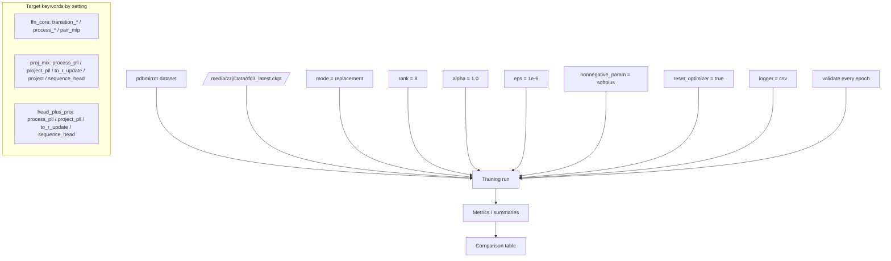

---

## Slide 10. 结果总览表与可视化


## Slide 10. 结果总览表与可视化


### 核心内容

下面直接贴实验结果表格。这个表格来自 `comparison_table.csv`，已经把每个 setting 的 best 指标、final 指标、参数量和替换层都整理好了。

| setting | status | summary_json | run_dir | best_val_lddt | delta_lddt_vs_baseline | best_val_loss | delta_loss_vs_baseline | best_epoch | best_epoch_loss | best_epoch_lddt | final_epoch | final_epoch_loss | final_epoch_lddt | trainable_params | total_params | replaced_layers |
| --- | --- | --- | --- | --- | --- | --- | --- | --- | --- | --- | --- | --- | --- | --- | --- | --- |
| baseline | success | `/home/zzj/protein/foundry/logs/train_nmf/sweep_nmf_final_single_structure_2026-08-06_11-18-52/baseline.step43205.run_summary.json` | `/home/zzj/protein/foundry/logs/train_nmf/sweep_nmf_final_single_structure_2026-08-06_11-18-52` | 0.2600 |  | 0.3912 |  | 581 | 0.3017 | 0.2569 | 589 | 0.3912 | 0.2600 | 168038994 | 336077988 |  |
| ffn_core | success | `/home/zzj/protein/foundry/logs/train_nmf/sweep_nmf_final_single_structure_2026-08-06_11-18-52/ffn_core.step43205.run_summary.json` | `/home/zzj/protein/foundry/logs/train_nmf/sweep_nmf_final_single_structure_2026-08-06_11-18-52` | 0.4745 | +0.2145 ↑ | 2.5040 | +2.1129 ↓ | 576 | 1.8561 | 0.5084 | 589 | 2.5040 | 0.4745 | 16603776 | 332204740 | process_c.1[Linear] in=128 out=128 rank=8 params=2048 ; diffusion_token_encoder.transition_1.0.linear_1[Linear] in=384 out=768 rank=8 params=9216 ; diffusion_token_encoder.transition_1.0.linear_2[Linear] in=384 out=768 rank=8 params=9216 ; diffusion_token_encoder.transition_1.0.linear_3[Linear] in=768 out=384 rank=8 params=9216 ; diffusion_token_encoder.transition_1.1.linear_1[Linear] in=384 out=768 rank=8 params=9216 ; diffusion_token_encoder.transition_1.1.linear_2[Linear] in=384 out=768 rank=8 params=9216 ; diffusion_token_encoder.transition_1.1.linear_3[Linear] in=768 out=384 rank=8 params=9216 ; diffusion_token_encoder.process_z.1[Linear] in=258 out=128 rank=8 params=3088 ; diffusion_token_encoder.transition_2.0.linear_1[Linear] in=128 out=256 rank=8 params=3072 ; diffusion_token_encoder.transition_2.0.linear_2[Linear] in=128 out=256 rank=8 params=3072 ; diffusion_token_encoder.transition_2.0.linear_3[Linear] in=256 out=128 rank=8 params=3072 ; diffusion_token_encoder.transition_2.1.linear_1[Linear] in=128 out=256 rank=8 params=3072 ; diffusion_token_encoder.transition_2.1.linear_2[Linear] in=128 out=256 rank=8 params=3072 ; diffusion_token_encoder.transition_2.1.linear_3[Linear] in=256 out=128 rank=8 params=3072 |
| proj_mix | success | `/home/zzj/protein/foundry/logs/train_nmf/sweep_nmf_final_single_structure_2026-08-06_11-18-52/proj_mix.step43205.run_summary.json` | `/home/zzj/protein/foundry/logs/train_nmf/sweep_nmf_final_single_structure_2026-08-06_11-18-52` | 0.5812 | +0.3212 ↑ | 3.3290 | +2.9379 ↓ | 587 | 3.2055 | 0.6636 | 589 | 3.3290 | 0.5812 | 16477392 | 335797204 | to_r_update.1[Linear] in=128 out=3 rank=8 params=1048 ; sequence_head.linear[Linear] in=768 out=32 rank=8 params=6432 ; process_n.0.1[Linear] in=256 out=128 rank=8 params=3072 ; process_n.1.1[Linear] in=256 out=384 rank=8 params=5120 |
| head_plus_proj | success | `/home/zzj/protein/foundry/logs/train_nmf/sweep_nmf_final_single_structure_2026-08-06_11-18-52/head_plus_proj.step43205.run_summary.json` | `/home/zzj/protein/foundry/logs/train_nmf/sweep_nmf_final_single_structure_2026-08-06_11-18-52` | 0.5910 | +0.3310 ↑ | 3.7016 | +3.3104 ↓ | 589 | 3.7016 | 0.5910 | 589 | 3.7016 | 0.5910 | 16461008 | 336042964 | to_r_update.1[Linear] in=128 out=3 rank=8 params=1048 ; sequence_head.linear[Linear] in=768 out=32 rank=8 params=6432 |

### 这一页怎么讲

这一页建议先直接看表格，再进行解释。表格中最关键的列是 `best_val_lddt`、`best_val_loss`、`final_epoch`、`final_epoch_loss` 和 `final_epoch_lddt`。从 best 指标看，baseline 的 `lddt` 为 0.2600，`ffn_core` 为 0.4745，`proj_mix` 为 0.5812，`head_plus_proj` 为 0.5910。也就是说，所有 NMF setting 的 `lddt` 都高于 baseline。与此同时，`loss` 从 baseline 的 0.3912 上升到 2.5040、3.3290 和 3.7016，说明替换后模型在损失函数上明显变差。`best_epoch` 和 `final_epoch` 的差异说明模型在训练过程中并不总是在最后一个 epoch 达到最优，有些 setting 在中间 epoch 就出现过更好的结构指标，但最终仍以最后记录的 final 指标作为收尾状态。

再看 `trainable_params` 和 `total_params`。baseline 的总参数量和 trainable 参数量接近，因为它几乎没有做低秩替换；而 NMF 组的 trainable 参数量下降得非常明显，说明替换后的确降低了可训练自由度。`replaced_layers` 列则明确告诉我们每个 setting 替换了哪些层，以及每层对应的输入输出维度和 rank。也就是说，这个表格不仅能说明结果，还能把结果和具体替换范围对应起来。

### 可直接照读的讲稿

这一页我直接用表格来展示结果。先看 `best_val_lddt`，baseline 是 0.2600，`ffn_core` 是 0.4745，`proj_mix` 是 0.5812，`head_plus_proj` 是 0.5910。这个结论很直接：所有 NMF setting 的结构相关指标都高于 baseline。再看 `best_val_loss`，baseline 只有 0.3912，但三个 NMF setting 分别变成 2.5040、3.3290 和 3.7016，这说明损失函数明显变差，而且这个变化幅度很大。

表格中的 `best_epoch` 和 `final_epoch` 也有意义。它告诉我们模型在训练过程里，最佳点并不一定出现在最后一个 epoch，有些 setting 中间阶段的指标更好，但最后记录的是最终收尾状态。`trainable_params` 和 `total_params` 这一列则说明，NMF 替换确实减少了训练自由度，不再是原始的全参数模型。最后一列 `replaced_layers` 很重要，因为它直接告诉我们每个 setting 到底替换了哪些层，所以后面的结果解释不是抽象的，而是可以直接回到具体模块去对应。

### Mermaid 图 1：best `lddt` 对比

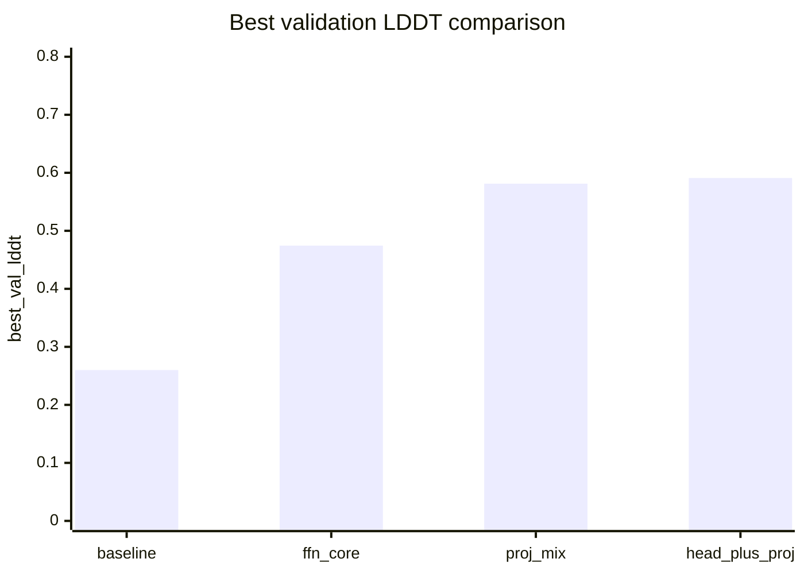

### Mermaid 图 2：best `loss` 对比

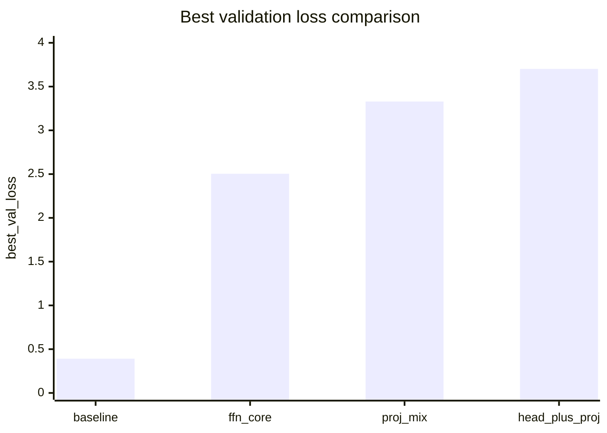

### 讲稿备注

- 如果你的 Mermaid 渲染器不支持 `xychart-beta`，可以退化成表格 + 结论图。

---


## Slide 11. `ffn_core` 分析

这一页建议按照“先看结果，再解释结果”的方式来讲。首先看 `lddt`，baseline 的 best `lddt` 是 0.2600，`ffn_core` 提升到 0.4745，`proj_mix` 提升到 0.5812，`head_plus_proj` 提升到 0.5910。这个结果说明，NMF 替换并没有使结构相似性指标下降，反而在这个任务上提高了它。然后看 `loss`，baseline 的 best `loss` 只有 0.3912，而三个 NMF setting 分别上升到 2.5040、3.3290 和 3.7016，这说明优化目标变差，而且变差幅度很大。因此，不能只说 NMF 让模型变好了，也不能只说 NMF 让模型变坏了。正确的结论是：在当前实验条件下，NMF 同时带来结构指标提升和损失函数恶化，这是一个明确的 trade-off。

### 可直接照读的讲稿

这一页展示的是结果总览。我们先看结构相关指标 `lddt`。baseline 的 best `lddt` 是 0.2600，而 `ffn_core`、`proj_mix`、`head_plus_proj` 分别提升到了 0.4745、0.5812 和 0.5910。这个结果说明，NMF 替换后，结构相关指标是上升的。接着看损失函数 `loss`，baseline 只有 0.3912，但 NMF 三组都显著升高，分别是 2.5040、3.3290 和 3.7016。这个结果说明，虽然结构指标更高，但优化目标并没有更好，反而明显变差。所以这次实验不能被简单描述成“更好”或者“更坏”，更准确的说法是：NMF 带来了结构指标的改善，但同时牺牲了损失函数表现，这是一个非常明确的 trade-off。

### Mermaid 图 1：best `lddt` 对比


### Mermaid 图 2：best `loss` 对比


### 讲稿备注

- 如果你的 Mermaid 渲染器不支持 `xychart-beta`，可以退化成表格 + 结论图。

---


## Slide 11. `ffn_core` 分析


### 核心内容

- best `lddt` 比 baseline 高：`0.4745` vs `0.2600`
- best `loss` 比 baseline 差：`2.5040` vs `0.3912`
- 结论：**mixed**，但它是当前最稳妥的 NMF 起点


### 这一页怎么讲

这一页需要说明为什么 `ffn_core` 是最值得优先考虑的设置。`ffn_core` 只替换一部分核心 transition 和 FFN 类层，因此它的改动范围最小，最接近保守实验。结果显示，这种替换已经能够明显提高 `lddt`，说明这类层在任务中确实参与了结构相关表示的形成。但同时，`loss` 也显著上升，说明虽然结构相似性没有下降，优化目标却变差了。这个结果支持一个明确的判断：FFN / transition 类层是适合 NMF 的候选层，但即使在最保守的方案下，NMF 也不是无损替换。它能够提升某些结构指标，但要付出优化性能的代价。

### 可直接照读的讲稿

先看 `ffn_core` 这一组。它只替换最核心、最保守的一类层，也就是 FFN 和 transition 类层，所以它可以看作是最稳妥的 NMF 设置。结果上看，`ffn_core` 的 best `lddt` 从 baseline 的 0.2600 提升到了 0.4745，这说明这类层被替换之后，结构相关指标确实改善了。但是与此同时，best `loss` 也从 0.3912 上升到了 2.5040，说明优化目标明显变差。也就是说，这一组不能被简单理解为“整体更好”，也不能理解为“整体失败”。更准确的结论是：FFN / transition 类层是当前最适合作为第一轮 NMF 替换对象的层组，但即使在最保守的设置下，也已经出现了明显的性能代价。

### Mermaid 图

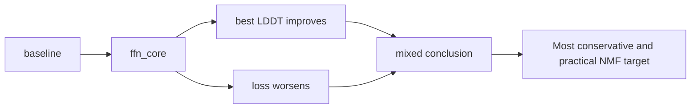


---


## Slide 12. `proj_mix` 分析


### 核心内容

- best `lddt` 进一步提升到 `0.5812`
- best `loss` 进一步恶化到 `3.3290`
- 说明 projection / mixing 层也可以做 NMF，但代价更大


### 这一页怎么讲

这一页要强调两点。第一，projection 和 mixing 类层确实可以替换，并且替换后 `lddt` 继续升高，说明这些层和结构相关输出也有明显关系。第二，代价进一步扩大，`loss` 比 `ffn_core` 更高，说明这类层对模型的整体行为影响更大，替换它们会更强烈地改变训练目标。这个结果表明，projection / mixing 层属于可替换层，但它们比 FFN 层更敏感，因此更适合在已经验证过保守方案之后再进行扩展。对于汇报来说，应该把这个结果表述为“可替换，但代价更高”，而不是简单地说“效果更好”。

### 可直接照读的讲稿

第二组是 `proj_mix`。这一组在 `ffn_core` 的基础上进一步加入了 projection 和 mixing 类层。结果显示，best `lddt` 进一步提高到了 0.5812，这说明替换范围扩大以后，结构相关指标仍然在上升。但是 best `loss` 也进一步升高到了 3.3290，说明损失函数的恶化更加明显。这个结果说明 projection 和 mixing 类层也可以做 NMF，但它们比 FFN 层更敏感，对模型整体行为的影响也更大。因此，这一组更适合被理解为“可以做，但代价更高”，而不是简单地理解为“比前一组更优”。

### Mermaid 图

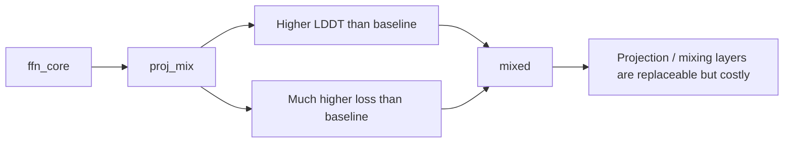


---


## Slide 13. `head_plus_proj` 分析


### 核心内容

- best `lddt` 最高：`0.5910`
- best `loss` 也最高：`3.7016`
- 输出端替换会显著改变模型行为


### 这一页怎么讲

这一页要说明输出头层为什么不能被轻率替换。输出头直接决定最终输出的形式，因此一旦替换，它对最终结果的影响会非常直接。从结果上看，`head_plus_proj` 的 `lddt` 是四组里最高的，但 `loss` 也是最高的。这说明输出层替换后，模型在某些结构指标上更接近目标，但它对训练目标函数的匹配程度却明显下降。这个现象说明输出头的作用不是简单的局部线性变换，而是和最终预测的整体校准紧密相关。因此，这一组更适合做“最激进层组”的对照实验，而不适合作为默认方案。

### 可直接照读的讲稿

第三组是 `head_plus_proj`。这一组在前面的基础上又加入了输出头，所以它是当前设置里最激进的一组。结果上看，它的 best `lddt` 达到了 0.5910，是四组里面最高的。但是它的 best `loss` 也达到了 3.7016，同样是四组里最高的。这说明输出层替换后，模型在某些结构指标上确实更接近目标，但同时它对整体损失函数的匹配变得更差。也就是说，输出头的作用并不只是做一个简单的线性映射，它还直接影响最终预测的校准方式。因此，这一组更适合作为激进 ablation 的对照，而不是默认替换方案。

### Mermaid 图

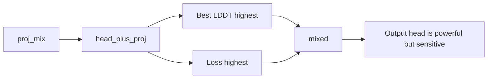


---


## Slide 14. 总结：哪些层最适合 NMF


### 核心内容

按优先级总结：

1. FFN / transition / process
2. projection / mixing
3. output head
4. attention 几何层（慎用）


### 这一页怎么讲

这一页是整个汇报的核心结论之一，需要非常明确地说出排序。根据当前实验结果，最适合优先尝试的是 FFN、transition 和 process 类层，因为它们是最稳定、最符合低秩替换预期的一组。其次是 projection 和 mixing 类层，这些层可以替换，但是替换之后带来的损失更大，因此不应作为首选。再次是输出头，它能够带来可观的指标变化，但敏感度高，风险也高。attention 几何层应当排在最后，原因是它们直接参与注意力分布的构造，替换难度最高，第一轮实验不建议优先使用。这个排序不是抽象经验，而是由当前实验数据支持的结论。

### 可直接照读的讲稿

这一页总结当前阶段的层选择结论。按照优先级来看，最适合做 NMF 的是 FFN、transition 和 process 类层。它们通常是最稳定的，也是最符合低秩非负替换预期的一类层。第二优先级是 projection 和 mixing 类层，这些层也可以替换，但它们带来的损失更大，所以不应当作为第一轮最优先目标。第三类是输出头，它对最终结果影响很直接，因此可以做，但风险更高。第四类是 attention 的几何层，也就是 `to_q`、`to_k`、`to_v` 这类层，它们对注意力分布的构造非常关键，所以不建议在第一轮就把它们作为主要替换对象。这个排序是由当前实验结果支持的，而不是主观判断。

### Mermaid 图

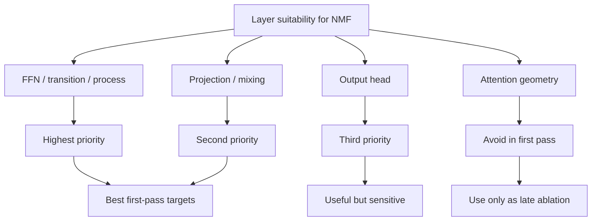


---


## Slide 15. 为什么结论是 mixed，而不是简单变好或变坏


### 核心内容

- `lddt` 变好：说明结构相似性提升
- `loss` 变差：说明训练目标 / 校准性退化
- 不能只看一个指标下结论
- 正确说法：**结构指标改善，但优化目标退化**


### 这一页怎么讲

这一页需要非常严谨地解释结果。`lddt` 是反映结构相关质量的指标，`loss` 是训练目标函数，二者含义不同，不能互相替代。当前实验里，NMF 使得 `lddt` 升高，这说明替换后的模型在某些结构预测方面更接近目标。但是与此同时，`loss` 大幅上升，这说明模型整体的优化状态并没有变好，反而更难拟合训练目标。因此，不能只看一个指标就下结论。如果只看 `lddt`，会错误地认为 NMF 使模型更好；如果只看 `loss`，会错误地认为 NMF 完全失败。更准确的表述是：NMF 在当前设置下改变了模型的优化行为，使结构指标提升，但同时损害了损失函数表现，这就是 mixed 结果。

### 可直接照读的讲稿

这一页要强调结果解释必须同时看多个指标。`lddt` 反映的是结构相关质量，`loss` 反映的是训练目标的优化情况，这两个指标不应该混为一谈。当前实验中，NMF 让 `lddt` 变高，这说明模型在某些结构相关输出上更接近目标。但是同时，`loss` 明显升高，这说明模型并没有在整体训练目标上变得更好，反而出现了明显退化。所以这次实验不能简单说成“更好”或者“更坏”。更准确的结论是：NMF 让结构指标改善了，但让优化目标变差了，因此整体结果应该被描述为 mixed，也就是存在明确的 trade-off。

### Mermaid 图

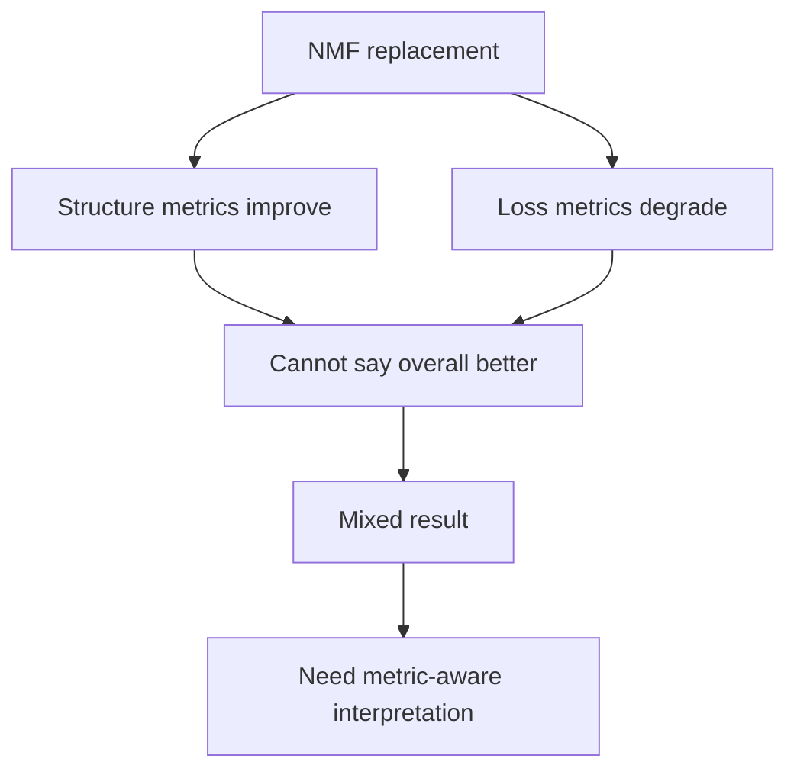


---


## Slide 16. 工程实现价值


### 核心内容

- NMF 已成功嵌入训练入口
- 可以通过 config 切换不同层组
- sweep 自动产出 markdown / csv 汇总
- 结果可复现、可比较、可继续扩展


### 这一页怎么讲

这一页要强调工作的工程价值。我们已经把 NMF 写成了可以通过配置控制的模块，而不是只能靠手工修改代码。训练入口统一在 `train_lora.py` 中，NMF 替换逻辑单独放在 `nmf.py`，实验层组通过配置文件控制，训练结束后自动输出 `run_summary.json`，再由 sweep 脚本生成汇总报告。这样做的意义在于，后续只需要修改目标层组或者超参数，就可以快速得到新的实验结果，而不必重新组织整个训练流程。也就是说，这套实现不是只服务于当前一次实验，它已经可以作为后续扩展和复现实验的基础框架。

### 可直接照读的讲稿

这一页说明这项工作的工程价值。首先，NMF 已经不是一个只能手工改代码的临时实现，而是一个可以通过配置控制的训练模块。训练入口统一在 `train_lora.py` 里，NMF 的核心逻辑单独放在 `nmf.py` 里，实验参数和层组选择通过配置文件控制。训练结束后，程序会自动生成 `run_summary.json`，然后由 sweep 脚本整理成 markdown 和 csv 汇总。这样做的好处是，后续如果想测试新的层组，只需要修改配置，不需要重新改训练框架。也就是说，这套实现已经不仅仅是一次实验，而是一个可以持续扩展和复用的实验平台。

### Mermaid 图

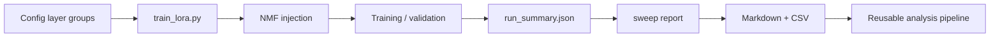


---


## Slide 17. 后续工作与可扩展方向


### 核心内容

- 加强 summary 指标：
  - `seq_recovery`
  - `token_lvl_sequence_loss`
  - `lp_norm`
  - `valid_t_fraction`
- 对 attention 层做更谨慎的 ablation
- 调 `rank` / `alpha` / `eps`
- 做多结构或更大数据集验证


### 这一页怎么讲

这一页需要说明后续工作怎么继续做。当前实验已经给出了层级排序和 mixed 结论，但如果要进一步解释“为什么这些层会产生这样的效果”，还需要更多指标支持。比如 `seq_recovery` 可以帮助判断序列层面的保留程度，`token_lvl_sequence_loss` 可以反映输出 token 级别的损失，`lp_norm` 可以帮助观察预测值的尺度变化，`valid_t_fraction` 可以说明哪些样本在有效区域内。这些指标都可以作为后续 summary 的补充。另外，attention 层目前还没有作为第一轮目标，需要更谨慎地尝试。最后，rank、alpha 和 eps 也值得做系统扫描，因为 NMF 的表达能力和约束强度会直接受到这些参数影响。

### 可直接照读的讲稿

这一页讲的是后续工作方向。当前实验已经足够支持一个初步结论，但如果要进一步解释这些结果，最好再补充一些训练和输出层面的指标。比如 `seq_recovery` 可以帮助我们观察序列恢复情况，`token_lvl_sequence_loss` 可以反映 token 级别的损失，`lp_norm` 可以帮助我们看预测值的尺度变化，`valid_t_fraction` 可以说明有效样本比例。这些指标都能让结论更完整。另外，attention 相关层目前还不适合作为第一轮主要目标，后续如果要做，也应该更谨慎地单独验证。最后，rank、alpha 和 eps 这些超参数也很重要，因为它们会直接影响低秩表示的容量和约束强度，所以后续应该做系统扫描，而不是固定一个值就结束。

### Mermaid 图

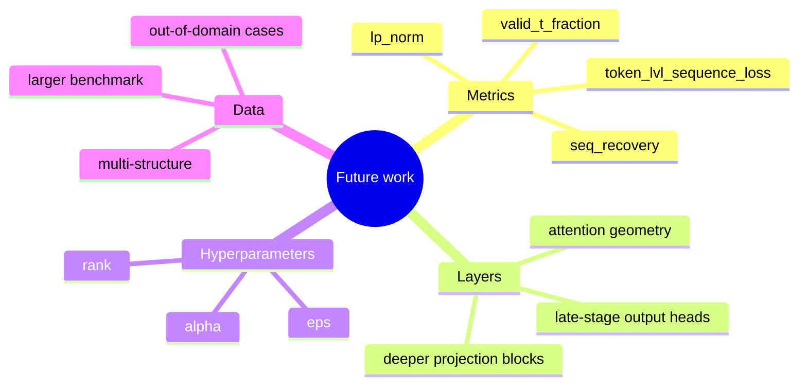


---


## Slide 18. 最后结论页


### 核心内容

一句话总结：

> 在 RFD3 上，替换式 NMF 最适合优先尝试 FFN / transition / projection 类线性层；它能抬高结构相似性指标，但也会明显牺牲训练 loss，因此当前结果是“结构收益与优化代价并存”的 mixed 结论。


### 这一页怎么讲

这一页要把全文收束起来。结论应该简洁、明确、可复述。当前实验已经表明，NMF 不是对所有层都同样有效，也不是对所有指标都同方向改善。它更适合作为一种结构替换和层分析工具，用来判断模型的不同模块是否具有可低秩化的属性。对于当前 RFD3 实验，最优先的替换对象是 FFN 和 transition 类层，其次是 projection 和 mixing 层，输出头可以作为更激进的对照，而 attention 几何层不应该在第一轮作为主要目标。最后要强调，这项工作已经形成了一套可复现的实验和分析流程，可以直接支持后续更深入的层级研究。

### 可直接照读的讲稿

最后我做一个总结。当前实验表明，替换式 NMF 在 RFD3 上是可实现、可复现、也可分析的。实验结果说明，最适合优先尝试的层是 FFN、transition 和 projection 类线性层；attention 几何层则不适合作为第一轮主要替换目标。与此同时，NMF 并没有带来单一方向上的改进，而是表现为结构指标提升、损失函数恶化的 mixed 结果。因此，这项工作的核心结论不是“ NMF 一定更好 ”，而是“ NMF 是一种可以用来分析模型层功能的结构替换方法 ”。这也是我认为这套实验最重要的价值。

### Mermaid 图

```mermaid
flowchart TB
    A[FFN / transition / projection layers] --> B[Good NMF targets]
    C[Attention geometry layers] --> D[Not first-pass targets]
    B --> E[Better structure metrics]
    B --> F[Higher loss trade-off]
    E --> G[Mixed conclusion]
    F --> G
    G --> H[NMF is a structural probe, not a free performance boost]
```


---


# PPT 制作建议


## 页面风格

- 颜色统一：蓝色 / 紫色系
- 结构图和结论图用不同强调色
- 不要一页塞太多字，口头讲稿放备注里


## 图表建议

1. 模型结构图
2. NMF 分解示意图
3. 实验配置流程图
4. 结果表格
5. 各 setting 对比图
6. layer suitability 排序图


## 排版建议

- 前半部分讲方法和实现
- 中间讲实验设计
- 后半部分讲结果和结论


## 讲述节奏建议

- 先讲“为什么做”
- 再讲“怎么做”
- 然后讲“结果如何”
- 最后讲“说明了什么”

---


# 适合口头汇报的一段开场白

> 这次工作主要围绕 RFD3 上的替换式 NMF 展开。我们不是简单地把所有线性层都替换掉，而是先从结构功能上分析哪些层更适合做低秩非负分解，再在源码里把这种替换做成可配置的训练路径，最后通过单结构实验比较不同层组的效果。结果显示，NMF 在结构指标上有提升，但在 loss 上有明显代价，因此结论是 mixed，而不是单纯更好或更坏。

---


# 适合结尾的一段总结

> 总的来说，这项实验验证了替换式 NMF 在 RFD3 中是可实现、可复现、可分析的；FFN / transition / projection 类层是最适合优先尝试的目标，而 attention 几何层不适合在第一轮就替换。当前结果表明，NMF 更像是一种对模型表征方式的重塑，而不是无损压缩或直接性能提升手段。

