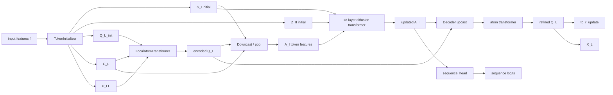

# RFD3 的 NMF + ZKP 选层指南

本文基于 RFD3 的源码与文档整理，目标不是泛泛讨论“哪里能做 NMF”，而是从 **三因子 NMF + 中间方阵 M 可做 ZKP proof target** 的角度，筛选最合适的层。

核心问题是：

> 哪些层最适合做三因子 NMF？
> 哪些层的中间方阵 `M` 最适合作为 proof target？
> 哪些层应明确排除？

---

## 1. RFD3 整体结构

RFD3 由两部分组成：

- `TokenInitializer`：输入特征初始化，构造 token / atom / pair 表示；
- `RFD3DiffusionModule`：扩散去噪主干，完成坐标更新和序列预测。

顶层结构在 `models/rfd3/src/rfd3/model/RFD3.py`：

```text
input features f
   │
   ├── TokenInitializer
   │     ├── token 1D embedding
   │     ├── atom 1D embedding
   │     ├── relative position / pair embeddings
   │     └── small Pairformer stack
   │
   └── DiffusionModule
         ├── atom encoder
         ├── token encoder
         ├── diffusion transformer
         ├── decoder
         └── sequence / coordinate heads
```

---

## 2. 为什么这里适合做三因子 NMF

我们关心的是这种形式：

\[
W \approx U M V
\]

其中：

- `U`: 输出侧投影
- `V`: 输入侧投影
- `M`: 中间 `rank × rank` 方阵

如果 `M` 是你要证明 integrity 的核心，那么最好的位置应当满足：

1. 语义上是“输入压缩 → 中间变换 → 输出恢复”；
2. 不直接定义 attention 几何；
3. 能把输入或中间表示压到一个清晰的低秩空间；
4. `M` 的变化可以被解释为一个独立、可验证的中间计算。

因此，**projection / FFN / head / token-atom 交互接口层**最合适。

---

## 3. RFD3 的 U-Net-like 主干

RFD3 的扩散主干不是标准图像 U-Net，但结构上非常像：

```text
atom-level  --->  token-level  --->  token bottleneck  --->  atom-level
   encoder            mix              diffusion             decoder
```

对应到源码：

- 编码段：`LocalAtomTransformer`、`Downcast`、`LinearEmbedWithPool`
- 瓶颈段：`LocalTokenTransformer`
- 解码段：`CompactStreamingDecoder`

### 图解



---

## 4. 哪些层最适合做三因子 NMF

### A. 最适合：编码 / 投影 / head 类

这些层最符合 `U M V` 的语义：输入投影到 rank 空间，中间 `M` 做核心变换，再投回输出。

#### 推荐层

- `transition_post_token`
- `transition_post_atom`
- `transition_1`
- `transition_2`
- `process_s_init`
- `process_z_init`
- `process_c`
- `process_s_trunk`
- `process_single_l`
- `process_single_m`
- `process_z`
- `pair_mlp`
- `process_pll`
- `project_pll`
- `upcast.project`
- `downcast.project`
- `to_r_update`
- `sequence_head`

#### 为什么它们最适合

- 主要是线性映射或 MLP 内部线性层；
- 语义接近“压缩—中间变换—恢复”；
- `M` 很自然可以当 proof target；
- 不直接破坏 attention 几何。

---

## 5. 哪些层的 `M` 最适合做 proof target

如果你的目标是用 ZKP 证明输入 integrity，那么 `M` 最适合放在“模型真正做信息整形”的位置。

### 第一优先级：输入整形 / 编码接口

这些层最适合作为 proof target，因为它们离输入最近，最适合证明“输入到中间态”的 integrity。

- `transition_post_token`
- `transition_post_atom`
- `process_s_init`
- `process_z_init`
- `process_c`
- `process_s_trunk`

### 第二优先级：token/atom 交互投影

这些层适合证明“中间表示没有被篡改，且投影路径一致”。

- `process_pll`
- `project_pll`
- `upcast.project`
- `downcast.project`
- `process_n`

### 第三优先级：输出前的可验证头

这些层适合证明“最终输出与中间计算一致”，但不是最强的输入 integrity 证据。

- `to_r_update`
- `sequence_head`

---

## 6. 哪些层应明确排除

### A. 必须排除：`to_q / to_k / to_v`

这些层直接定义 attention 几何，不适合作为三因子 NMF 的首选，更不适合作为 ZKP proof target。

原因：

- 它们的作用不是干净的“投影—中间矩阵—恢复”；
- 对符号、尺度和相似度非常敏感；
- 中间 `M` 很难单独解释为 integrity 证据。

### B. attention 核心 bias / gating 路径

排除：

- `to_b`
- `to_g`
- attention pair bias 的核心内部映射

原因：

- 这是 attention 机制的一部分，不是清晰的线性瓶颈；
- ZKP 证明成本高，语义也不干净。

### C. 过于贴近几何坐标的小投影

排除：

- `process_r`
- `process_a`

原因：

- 这些层非常贴近 3D 坐标语义；
- 虽然是线性层，但更像几何接口，不是好的中间证明点。

---

## 7. 按 U-Net 段落给出推荐

### 7.1 Encoder 段

**最推荐做 NMF + ZKP**。

优先层：

- `transition_post_token`
- `transition_post_atom`
- `process_s_init`
- `process_z_init`
- `process_c`
- `process_s_trunk`

这里最适合把 `M` 当 proof target。

### 7.2 Bottleneck 段

**可做，但次于 encoder**。

优先层：

- `process_z`
- `pair_mlp`
- `process_n`

这里适合证明中间态一致性，而不是输入 integrity 本身。

### 7.3 Decoder 段

**可做，适合输出一致性证明**。

优先层：

- `upcast.project`
- `downcast.project`
- `to_r_update`
- `sequence_head`

这里适合证明输出是由受控中间表示计算出来的。

---

## 8. 最终筛选清单

### 最适合做三因子 NMF

- `transition_post_token`
- `transition_post_atom`
- `process_s_init`
- `process_z_init`
- `process_c`
- `process_s_trunk`
- `process_pll`
- `project_pll`
- `upcast.project`
- `downcast.project`
- `to_r_update`
- `sequence_head`

### `M` 最适合做 proof target

按优先级：

1. `transition_post_token`
2. `transition_post_atom`
3. `process_s_init`
4. `process_z_init`
5. `process_c`
6. `process_s_trunk`
7. `process_pll` / `project_pll`
8. `upcast.project` / `downcast.project`
9. `to_r_update`
10. `sequence_head`

### 明确排除

- `to_q`
- `to_k`
- `to_v`
- `to_b`
- `to_g`
- attention pair bias 内部核心映射
- `process_r`
- `process_a`

---

## 9. 一句话结论

如果你的目标是“**三因子 NMF + 用中间方阵 `M` 做 ZKP 的 integrity proof**”，那么 RFD3 中最值得选的是 **encoder / projection / output-head** 这类线性混合层；而 `q/k/v`、attention bias 和几何接口层应明确排除。
